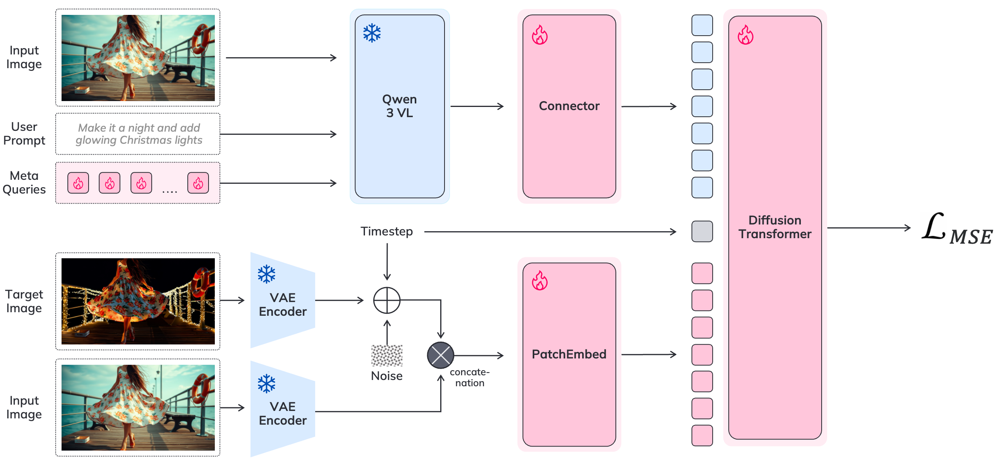

# VIBE: Visual Instruction Based Editor

This is the official landing page for the research article **"VIBE: Visual Instruction Based Editor"**.

## Model Information

VIBE requires **24 GB of GPU memory**, and can generate edited images at up to **2K resolution in 4 seconds** on an NVIDIA H100.

## Model Pipeline



## Links

- **Model on HuggingFace**: [https://huggingface.co/iitolstykh/VIBE-Image-Edit](https://huggingface.co/iitolstykh/VIBE-Image-Edit)
- **Code on GitHub**: [https://github.com/ai-forever/VIBE](https://github.com/ai-forever/VIBE)

## Citation

If you find this work useful, please cite it using the following BibTeX:

```bibtex
@article{vibe2025,
  title  = {VIBE: Visual Instruction Based Editor},
  author = {Alekseenko Grigorii and Gordeev Aleksandr and Tostykh Irina and Suleimanov Bulat and Dokholyan Vladimir and Georgii Fedorov and Sergey Yakubson and Tsybina Aleksandra and Chernyshov Mikhail and Kuprashevich Maksim},
  journal = {arXiv preprint},
  year = {2025}
}
```
